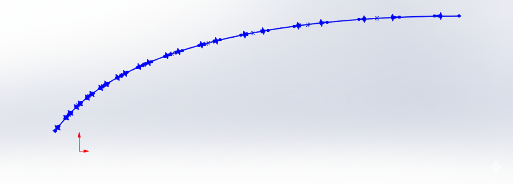

# SolidWorks-Spline-MACRO




## Table of Contents

- [About](#about)
- [Features](#features)
- [Tech & Concepts](#tech--concepts)
- [Repository structure](#repository-structure)
- [How to install](#how-to-install)
- [How to use](#how-to-use)
- [Demo](#demo)
- [Next steps](#next-steps)
- [License](#license)
- [Author / Contact](#author--contact)


## About

This project provides a SolidWorks VBA macro that reads a list of coordinates from a file and automatically creates a spline inside an active sketch.

Originally based on Xarial’s CodeStack example, and extended to include tangent angle (theta) control.

### Motivation
SolidWorks correctly places the points along a spline, but did not respect the desired tangency angles. While working on an aerospike nozzle contour, I needed precise control over the tangents at each point, and there were too many points to adjust manually. This macro automates the process, ensuring both position and tangency are applied correctly.

## Features

- Reads point coordinates from a text/CSV file.
- Creates a spline in the active sketch.
- Allows tangent angle control (`theta`) at each point.
- Can be easily modified to handle header files.
- Can be modified to work with other entities (arcs, polylines, etc).


## Tech & Concepts

- Language: VBA (Visual Basic for Applications).
- Platform: SolidWorks API.
- Concepts: File I/O, spline generation, tangent control, CAD automation.


## Repository structure
```
solidworks-spline-macro/
├── MacroSpline.swp          # compiled SolidWorks macro (runnable)
├── src/
│   └── MacroSpline.bas      # source VBA code (editable text version)
├── examples/
│   └── example_points.csv   # sample input file
├── assets/
│   └── banner.png
├── README.md
└── LICENSE
```


## How to install

1. Clone the repository
```bash
git clone git@github.com:VictorLiotti/solidworks-spline-macro.git
cd solidworks-spline-macro
```

2. Open SolidWorks → Tools > Macro > Run

3. Select `MacroSpline.swp`

(Optional) Import `MacroSpline.bas` if you want to inspect/modify the VBA code.


## How to use

1. Open or create a part file in SolidWorks.
2. Open or create a sketch (must be active).
3. Prepare a text file with point coordinates (e.g. **x y z and theta** per line)
	- The macro assumes a text file with no header
	- If you include a header, make sure to edit 'ReadFile()' argument in line 42:
		- `vPts = ReadFile(FILE_PATH, True)` for a file **with header** 
		- `vPts = ReadFile(FILE_PATH, False)` for a file **without header** 
4. Run the macro (Tools > Macro > Run).
	- You might need to edit the macro to add your **input file path** in line 13:
		- `Const FILE_PATH As String = "C:\Users\...\file.txt"`
5. A spline will be generated through the given points.


### Example input file

The macro expects **comma-separated values (CSV style)** with the following columns:

- `x` → X coordinate  
- `y` → Y coordinate  
- `z` → Z coordinate  
- `theta` → tangent radial direction (angle, in radians)  

Example (`example_points.csv` included in this repository):

```csv
x,y,z,theta
-0.008,0.006,0,0.868
-0.002,0.012,0,0.797
0.002,0.016,0,0.689
0.008,0.020,0,0.575
0.015,0.025,0,0.462
0.026,0.029,0,0.355
0.040,0.034,0,0.256
0.060,0.038,0,0.163
0.086,0.041,0,0.078
0.120,0.042,0,0.000
```

In this case, `vPts = ReadFile(FILE_PATH, True)`.


## Demo

<a href="./assets/demo.gif">
  
</a>


## Next steps

> Not necessarily in priority order

- Organize the VBA code and update macro package
- Add pseudocode + comments
- Add error messages for empty/invalid files.
- Improve handling for large point sets: currently, if too many points are input, the macro skips tangent control for the first points.


## License

This project is MIT licensed.


## Author / Contact

Víctor L. - [Github](https://github.com/VictorLiotti) - [Linkedin](https://www.linkedin.com/in/victor-liotti)

Xarial - [Github](https://github.com/xarial) - [Linkedin](https://www.linkedin.com/company/xarial/)